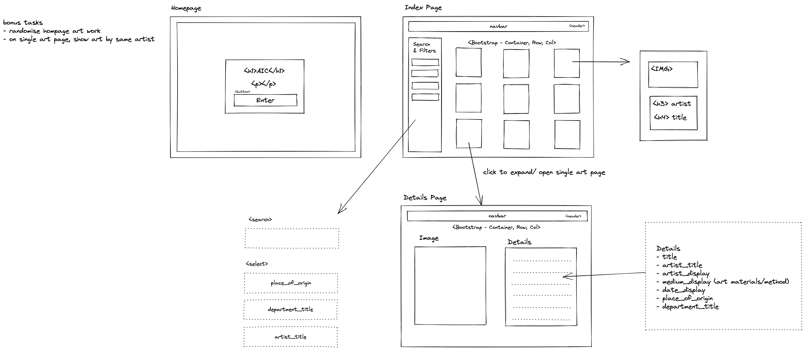
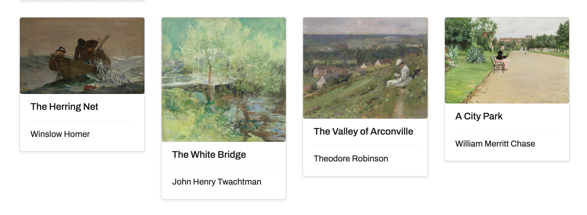
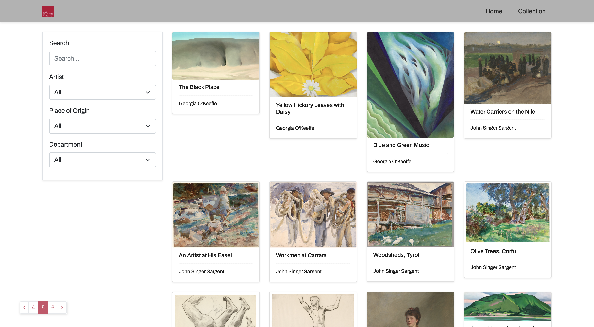
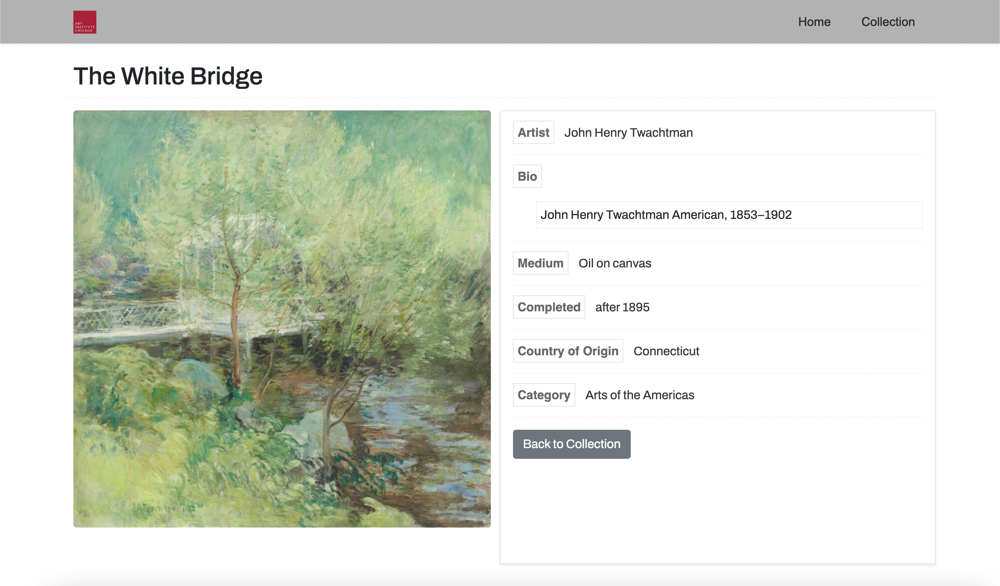

## SEI-project-two

# Project 2 - Art Institute of Chicago Exhibit viewer


## Overview

The second of four projects on the Software Engineering Immersive course at General Assembly. For this project, I paired up with [eli099](https://github.com/eli099) for a two day hackathon where we have to build a React application that consumes a third party API. 

Link to deployed project [art-ichacago](https://art-ichicago.netlify.app//) 

## Table of Contents

- [Project Brief](#project-brief)
- [Technologies Used](#technologies-used)
- [Usage](#usage)
- [Comments/Bugs](#comments-bugs)
- [Reflections](#reflections)
  - [Challenges](#challenges)
  - [Wins](#wins)
  - [Dev Journal](#dev-journal)
- [Potential Future Updates](#potential-future-updates)

## Project Brief

Pair project  
Time frame: 2 days  
Brief: Build a React app that consumes a public api
- App must have several components
- Consume a public api of your choosing

## Technologies Used

#### Languages and Frameworks


#### Dev-Tools


#### Testing 

 


## Usage

### Art-iChicago 

Art-ichicago is an app where the user can view various exhibits from the Art Institute of Chicago

#### Navigation

- On Landing page, click collections to view exhibit collections
- On Collections page, click on an exhibit item to navigate to that item
  - Individual pages contain more details of the piece
- Items on the page can be searched and filtered on side menu

## Comments/ Bugs

- App can be a little slow to load the exhibits due to the number of items
- The app currently only filters and searches the current page. Given more time, we would've liked to figure out how to search all items available in the database.

## Development Reflections

It was great to have a teammate to bounce ideas off and improve by coding together. Discovering how many public APIs out there and seeing what can be done with them is eye opening.
 On the app itself, a few things to note:
 - The API endpoint used contains thousands of exhibits, in hindsight, limiting the items per page will improve load times.
 - Originally we were unaware the API database was being updated fairly regularly and so we thought our app was breaking. Our approach may have changed a little if we knew the database wasn't static.

### Challenges  
- The search and filter function didn't work initially but we managed to fix it
- We got the pagination working but would have been have been nice to be able to cycle through more pages

### Wins  
- Using the live share feature in VSCode made coding along together really convenient
- Fixing the search and filter function
- Being able utilise a third party API in our project 

### Dev Journal  
<details>

<summary>Click</summary>  


#### Day 1 - Planning and initial coding

[eli099](https://github.com/eli099) and I both tested some public APIs independently and shared with each other our possible ideas. We decided on the Art Institute of Chicago public API for our project as the other APIs were either too limited or complicated to use. 

We used zoom video chat and Slack for communication and Excalidraw to draft our ideas. For this pair project we decided to code together on one file using VSCode’s live share feature.
We decided to work on all the pages together but we did shift focus to separate pages each to make sure everything could be done on time.

1. Our idea is to create a viewable archive for the exhibits in the Art institute of Chicago API database.

2. Our app will be a gallery of exhibits
 - User will be able to search and filter the exhibits by artist, exhibit origin and department the exhibit belongs too
- User can click on individual exhibits to view more detailed information

##### Building out the index/collections page

Using Bootstrap as our styling framework. We mapped through our results and created a card for each exhibit item

``` 
{/* The Art Index */}
       <Col md="9">
        <Row>
           {filteredArt.map((art) => {
             const { id, title, artist_title, image_id } = art
             return (
               <Col key={id} md="6" lg="3" className="art mb-4 container-fluid">
                 <Link to={`/artworks/${id}`}>
                   <Card className="shadow-sm">
                     <Card.Img src={`https://www.artic.edu/iiif/2/${image_id}/full/843,/0/default.jpg`} />
                     <Card.Body>
                       <Card.Title>{title}</Card.Title>
                       <hr />
                       <Card.Text>{artist_title}</Card.Text>
                     </Card.Body>
                   </Card>
                 </Link>
               </Col>
             )
           })}
         </Row>
       </Col></codeblock>
```
- Cards example
  

##### Search and filters  

When building out the search and filters, we encountered a slight hiccup where results weren't being displayed. It turns out it was a problem with our regexSearch terms. We fixed it by being more comprehensive with the terms.

```
useEffect(() => {
   if (artList.length) {
     const regexSearch = new RegExp(filters.searchTerm, 'i')
     console.log(regexSearch)
     const filtered = artList.filter(art => {
       return (regexSearch.test(art.artist_title) || regexSearch.test(art.title) || regexSearch.test(art.term_titles) || regexSearch.test(art.place_of_origin) || regexSearch.test(art.department_title)) && (art.artist_title === filters.artist || filters.artist === 'all') && (art.place_of_origin
         === filters.placeoforigin || filters.placeoforigin === 'all') && (art.department_title === filters.department || filters.department === 'all')
    })
     setFilteredArt(filtered)
     console.log('filtered art ->', filteredArt)
   }
 }, [filters, artList])
```



##### Detailed exhibit page  

Template for the single exhibits page features various additional details. At one point we considered being able to navigate to other exhibits with related tags but didn't implement the feature due to time.  

  

##### Problem with images  

We seem to have some kind of error where the image URL from the endpoint is not displaying. We haven't changed the code but images are breaking for some reason.  
**Update*  
It turns out it wasn't our code. The API is being updated with new exhibit items and the new items didn't have the images ready. A little less stress now knowing we didn't break anything.  

#### Day 2 - Styling + additional features  

We decided on a more minimalist styling, perhaps in hindsight it may look a bit too plain for some but we wanted something clean and legible.  

After discovering new items are being added to the API database we needed a way to access items passed the one hundred item per page limit. So we added pagination into the page to help with navigation.

An unfortunate issue that stemmed from discovering the dynamic nature of the API means our initial coding and endpoint usage only allows us to search and filter items on the current page. Perhaps in the future we can add a more complete search and filter feature that covers all items available.


</details>

## Potential future updates

<details>
<summary>Improvements</summary>

 - [ ] Ability to search and filter entire database instead of current page only
 - [ ] Optimising loading times
 - [ ] Improve pagination implementation

</details>

## Credits

API: Art Institute of Chicago [Public API](https://www.artic.edu/open-access/public-api)
